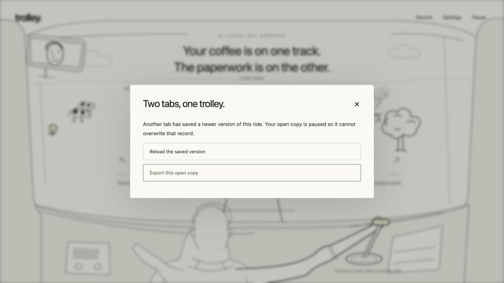

# Browser save-conflict recovery check

Status: **passed for the exercised private two-tab workflow**. Performed 22 September 2026 local time against `http://127.0.0.1:4181/`, using the Codex in-app browser and real browser IndexedDB. No viewport override, source mutation, collector activation or public data submission was used. This checks the actual integrated UI in addition to the seven fake-indexeddb persistence tests.

Artifact metadata read after the check at `2026-09-23T03:56:56Z`: engine `2.0.0`, content `2.0.0-slice.1`, profile `development-slice`, collector v2 disabled; `dist/game.js` SHA-256 `b2ed7e82a56ab950ba6e1a2a840ae1b42d7502841e31c0346cb422ed6448787a`. This test did not rebuild or mutate the artifact.

## Procedure and observed result

1. Opened tab A and started a fresh run. The sharing checkbox was disabled and the page explicitly said the development run stayed on the device. The coffee/paperwork opening mapped coffee left and paperwork right.
2. Opened tab B at the same origin and selected **Resume your saved ride**. It displayed the same opening and side mapping. The coordinator's separate test run was on a different decision and was not selected.
3. Tab B selected coffee and committed it. The ordinary consequence was “The forms are a little harder to read now.”
4. Stale tab A selected paperwork and attempted a commit. It displayed **Two tabs, one trolley.**, explained that another tab had saved a newer version, and offered **Reload the saved version** and **Export this open copy**. It did not present the stale branch as a saved outcome.
5. **Export this open copy** downloaded an actual JSON file. Inspection found revision 1 with requested/executed option `forms`, sharing false, and no `secret`, `queue`, `savedRevision` or `saveVersion` fields.
6. Tab B continued to the lunch-cart decision. Tab A used **Reload the saved version**, then **Resume your saved ride**. It resumed at decision 2 (`S1-12`). Its visible run record contained exactly one decision with requested/executed option `coffee`, executor `human`, status `free`.
7. Exporting the resumed record produced a second JSON file. Both exports have the same run ID, but preserve their distinct branches: the unsaved export contains `forms`, while the stored/resumed export contains `coffee`. The stored record was not overwritten by the stale commit. Its export also excludes all private/local-only fields listed above.
8. Both tabs returned empty captured warning/error lists. The test-created tabs were closed. The synthetic local save and Downloads artifacts remain available; no unrelated run was removed.

## Artifacts

Actual screenshot: `reports/validation/screenshots/save-conflict.png`, 41,399 bytes, SHA-256 `dfe6364c5d2cb40336c4e57c248d9c5f79c4a691ac40d0114bd2c10c5482e341`.

The synthetic JSON exports stay in the local Downloads folder rather than the public build or repository:

| File | Bytes | SHA-256 |
| --- | ---: | --- |
| `trolley-unsaved-copy.json` | 12,851 | `1aad370d7583792667f864bfabd66e5ae6bbf7bf02f1a852acf09b31e6b7cb58` |
| `trolley-run.json` | 13,637 | `43ba5f133db51b35f26cabc7b04236f9dad1df6d541a7b98b41a53287893b6cf` |

## Limits

This was private play with v2 collection disabled. It does not exercise a live collector, in-flight upload cancellation, remote withdrawal or network-service guarantees. DATA separately implemented/tested the conflict-to-upload boundary; that evidence must remain distinguished from this browser check.

This covers one supported in-app browser on the current workstation. It is not a Safari/Firefox/physical-phone compatibility claim. Quota aborts, simultaneous transaction races, deleted-run protection, legacy metadata normalization and same-revision queue conflicts were exercised in the automated persistence suite, not repeated here. The newly added per-record resume buttons were not part of this loaded build; this check used the existing latest-save resume flow, coordinated so it selected the isolated test run.

The full G3/G4 and public-release gates remain open despite this specific workflow passing.

## Completed-ending export follow-up — 23 September 2026

The coordinator reported that replay and run-record export clicks in an existing test tab produced no file and no console error. A separate fresh browser tab at the same origin opened **Saved records → View this ending**, selecting the sole completed record, **14 decisions · Someone can still say no**. No choice, preference or consent state was changed.

Ordinary CUA `getByRole('button', ...).click()` on **Export replay** downloaded `/Users/ammaraziz/Downloads/trolley-replay.json` at 00:04:05 local time. Its JSON contains 14 decisions and the `accountable` ending. File size: 70,614 bytes; SHA-256 `3ef133cdecb21ac8e6b0049bfc71f40a0feb4f62dff1f77d6fa01dfb81e875ce`.

In that same tab, **Read your decisions → Export this run** downloaded `/Users/ammaraziz/Downloads/trolley-run (1).json` at 00:04:41. It also contains 14 decisions and the `accountable` ending, with no secret, queue or local save-counter fields. File size: 67,782 bytes; SHA-256 `2accd0c1aaec0460c6dcb5cf62207e86d8effd8622bb2d609feb2089b420bc18`. The browser retained the earlier `trolley-run.json`, adding the `(1)` suffix for the new file.

The fresh-tab download path is verified; the cause of the earlier tab's failure is not established. No speculative `safeDownload` change was made. A stale loaded bundle or tab/download context is a possibility, not a diagnosed cause. Earlier use of `waitForEvent('download')` timed out even when a recording successfully arrived in Downloads, so filesystem existence and JSON content were checked directly. These exports are available for the coordinator's separate CLI replay verification; downloading a replay alone does not establish replay equality.
